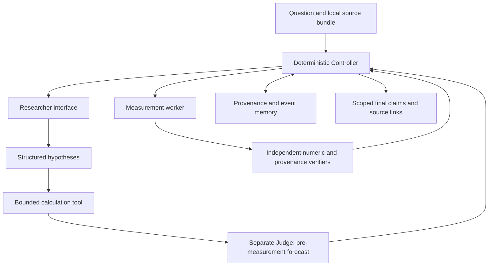

# Model-1 architecture and invariants

Status: implemented miniature, 2026-09-24. Scientific baseline: the existing AIM handbook and final-design specifications. Prototype scope decisions are recorded in [DECISIONS](DECISIONS.md).

## Component ownership

| Component | Current implementation | Responsibility and boundary |
|---|---|---|
| Researcher | `Researcher` protocol; `PolynomialResearcher`; `TransformerResearcher` | Propose plans/hypotheses; cannot mark claims verified. The working reference fits candidate polynomials. The neural adapter loads only an AIM checkpoint and strictly parses coefficient JSON. |
| Judge | `Judge` protocol; `VerificationFirstJudge`; `CalibratedJudge` | Forecast one defined event and request verification or abstain. It cannot certify truth or alter Controller-owned state. |
| Controller | `Controller` | Validates references and action budgets; owns state transitions, verifier execution and final status. |
| Tools | `Action`, `ToolResult`, `ToolRunner` | Allowlisted CALCULATE and MEASURE operations in short-lived subprocesses. No shell, eval, arbitrary code or network actions. |
| Verifiers | `Verifier` protocol; numeric/provenance implementations | Evaluate explicit predicates and return PASS/FAIL/UNKNOWN/ERROR/TIMEOUT with claim-content binding, scope and evidence IDs. |
| Memory | SQLite ledger and content-addressed UTF-8 objects | Preserve source versions, exact spans, graph edges, forecasts and every state revision. |
| Training/evaluation | Separate entry points | Train weights and score predefined evidence without changing runtime truth rules. |

The Controller passes copies to Researcher and Judge interfaces. The synthetic experimental target is not placed in either component's pre-measurement state. This is an API isolation boundary, not an operating-system sandbox against hostile Python plugins; adapters are trusted project code.

## State and contracts

`ResearchState` contains schema version, question, topic, target, phase, plan, assumptions, evidence, observed points, hypotheses, claims, tool results, verification records, contradictions, unresolved issues and final response. Each phase is appended as a full snapshot. Replay checks the hash chain and reconstructs the final state.

State phases are CREATED → PLANNED → RETRIEVED → HYPOTHESIZED → PREDICTED → JUDGED_AND_REVISED → FINAL, with controlled early exits when evidence, output contracts or budgets fail. Unhandled failures produce a retained FAILED run.

Current hypothesis schema is deliberately bounded: unique ID, 1–3 ascending-power coefficients, existing evidence IDs and rationale. Supported source observations are JSON `{ "topic": "...", "observations": [[x,y], ...] }`. Other prose is inert data. Sources with conflicting values at the same x produce unresolved contradictions; the implementation does not pick whichever source is convenient.

An action has an ID, allowlisted name, structured arguments and deadline. Controller validates returned action identity. `subprocess.run(..., timeout=...)` terminates the worker on expiration. Input length is capped; finite numeric domains and source counts are bounded. This is suitable for the two included numerical operations. An arbitrary-code verifier requires a different, independently reviewed sandbox with resource and network limits.

## Claim status rules

- HYPOTHESIS: candidate before checks.
- VERIFIED: both exact-span integrity and numeric agreement verifiers passed, with hashes bound to the unchanged claim contents.
- CONTRADICTED: independent numeric check failed and cited spans remain intact.
- UNKNOWN: evidence unavailable, timeout/error, conflicting observations, abstention or exhausted budget.
- UNVERIFIED: reserved explicit status for future adapters; not a synonym for VERIFIED.

The final validation rechecks every evidence record and the verifier hashes supporting each verified claim. A confidence of 1.0 does not change these rules. A numeric check only establishes agreement with the included synthetic measurement at the requested x and tolerance. It does not establish the causal law, source reliability, arbitrary natural-language entailment, or general scientific truth.

## Provenance

Sources preserve URI, title, declared rights, version, SHA-256, retrieval time, parser version and a retrievability flag. Exact character spans preserve original source hash, start/end, quote hash and locator. Identical text at a different declared version remains a different source record. Re-ingesting identical metadata is idempotent.

Edges include EXTRACTED_FROM, DERIVED_FROM, CHECKED_BY and USED. The event stream includes STATE, ACTION, RESULT, FORECAST_BEFORE_MEASUREMENT, VERIFICATION, CLAIM_REVISED and controlled/unhandled failures. SQLite triggers prevent normal event updates/deletions. Hash checks detect changed objects and ledger records. These are tamper-evident local records, not signatures or protection against an administrator rewriting the entire database and its hashes.

Final responses link stored objects through relative paths inside the run. Graph lookup and deterministic lexical retrieval are present. Cross-run semantic memory, embeddings, literature deduplication, document parser suites, retraction handling and distributed storage remain future adapters. SQLite schema 1 has no migration framework yet; create a new run per invocation and version any persistent schema change explicitly.

## Model implementation

The reference neural backend is a dense causal decoder: RMSNorm, RoPE, causal SDPA, SwiGLU, grouped query attention through repeated KV heads, tied input/output embeddings. The delivered model is 2 layers, width 64, 4 query heads, 2 KV heads, FFN 128, context 256, and a 259-entry UTF-8 byte vocabulary. It has 90,624 trainable parameters. Every weight is initialized locally; there is no pretrained download path.

The separate Judge is a 5 → 32 → 1 Tanh MLP with 225 parameters. Features describe candidate degree, observed-point count, observed residual, distance to the next x and normalized prediction magnitude. This parameter count is only appropriate to the five-feature synthetic problem. A language-based research Judge requires separate design experiments; 225 is not its recommended final size.

The byte tokenizer gives transparent Unicode round trips without external assets. It is inefficient for a large text corpus. Training a licensed-corpus BPE/unigram tokenizer, evaluating code/math/Unicode segmentation, and choosing context length remain explicit future decisions. The decoder currently recomputes its whole prefix during generation; there is no KV cache, quantization, long-context validation or optimized distributed model execution.

## Reproducibility boundary

Each new run archives implementation/config/fixture sources, hashes the configuration and inputs, records software/platform/Git availability, and writes immutable artifact names. Dataset exports and model checkpoints include version, split, seed/configuration, optimizer, fixed reference, torch RNG and parent identity. Current batches and data generation are deterministic, so no separate dataloader cursor is required beyond `step`. Exact continuation is tested on this CPU implementation; cross-version/device bitwise identity is not claimed.

The checkpoint origin field is a project provenance declaration, not a cryptographic proof that weights were never imported. Sidecars detect accidental alteration but are not signed. Only trusted local project checkpoints should be loaded. The source snapshots and parent hashes make lineage auditable.
