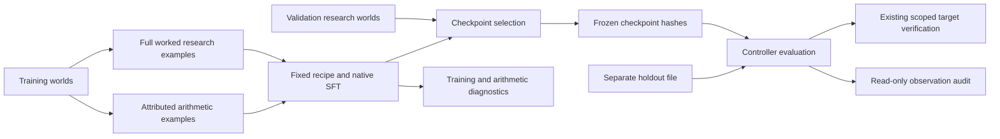

# Arithmetic curriculum and observation-consistency audit

The [Phase 2A.2 protocol](experiments/phase-2a2-protocol.md) specifies the hypothesis, data exclusion, recipe, selection rule and acceptance gates. This is an SFT experiment at the existing 228,096-parameter scale. It preserves the Researcher/Judge/Controller/Verifier/Memory separation and the distinct preference, RLVR and calibration pipelines.

## Reproduce

From `model-1/` in the recorded Python/torch environment:

```sh
.venv/bin/python -m aim.curriculum_reproduce
```

The command runs all tests with a 120-second preflight deadline and rejects skipped tests, generates the new dataset, trains both recipes across three seeds, freezes selected checkpoints, evaluates the actual research loop, and audits observation consistency through read-only source memory. Each stage writes a pointer as soon as it finishes; failures preserve earlier artifacts. The default config is `configs/arithmetic-curriculum.json`.

Individual stages:

```sh
.venv/bin/python -m aim.curriculum_data
.venv/bin/python -m aim.curriculum_train \
  --data runs/<curriculum-dataset>/train-validation.json
.venv/bin/python -m aim.curriculum_eval \
  --selection runs/<curriculum-training>/selected-models.json \
  --holdout runs/<curriculum-dataset>/holdout.json
```

Use actual paths printed by each command. Keep checkpoints, sidecars, ancestor runs and data. Source archives, environment, Git revision/status, hashes, seeds, task counts and failures are retained locally. Portable phase reports publish the measured evidence. Do not rerun on exposed holdout outcomes to select a better recipe and call that unseen evaluation.

## Data and recipe



Diagnostic scores do not feed checkpoint selection. Holdout and label-bearing audit files do not feed training. The second audit preserves the original target claim and stores its own hypothesis-level result.

The new generator excludes all 1,408 coefficient vectors from both preceding experiments and expands c0/c1 to -19..19 because the old linear pool is nearly exhausted. Each arm sees the same new 512 training worlds, 64 validation worlds, and frozen 64 test plus 64 cubic OOD worlds. Results are not directly comparable to historical scores because the world distribution changed.

The training file has only training and validation rows. Each contains its full research prompt/response and four attributable auxiliary examples: two signed subtractions, one second difference, and one coefficient reconstruction. The auxiliary examples derive from that row's observed values, with the same world group and split. The loader recomputes their teacher labels and rejects altered fields. Hidden test/OOD coefficients and historical exclusions live in `split-audit.json`; the trainer never opens it or the holdout file. Trainer metadata uses an explicit allowlist and hashes rather than new label-bearing membership.

Both arms draw 16 world indices per update from identical seeded samplers. The baseline uses all 16 as worked research examples. The curriculum substitutes eight subtraction examples during updates 1–600, four second-difference examples during 601–1200, and four reconstruction examples during 1201–1800. Research prompts still provide only original observations and target x; no intermediate answer is injected at inference.

Each recipe runs 1,800 updates with fixed input padding to 256 positions: 7,372,800 processed positions. Same tensor shapes approximate equal dense compute, not measured equal FLOPs or wall time. Baseline research presentations total 28,800; curriculum research presentations total 19,200 plus 9,600 auxiliary examples. Thus primary results compare recipes with different information/exposure mixtures. A third arm controlling research exposure is not part of this experiment.

## Training and continuation

Both recipes minimize response-token cross-entropy, including EOS, with the existing native decoder and byte tokenizer. No auxiliary reward, combined RL objective or pretrained asset is introduced. Checkpoint selection uses only full-research validation agreement, validity, response NLL and earliest tie. An earlier checkpoint may be selected even though both complete the full registered budget.

Checkpoints additionally preserve cumulative task counts, a rolling hash of sampled world identities and their accounting start step. Resume derives curriculum stage from the absolute update number. Paired completed runs require equal initial tensors, final sampler RNG, world-sampling digest and processed-position count. Tests compare resumed versus uninterrupted weights, sampling history, task accounting and original initialization lineage.

The full reproduction driver starts fresh paired experiments. Programmatic `train_seed(..., resume=...)` supports curriculum continuation; it does not automatically assemble an interrupted six-run comparison. Cross-machine checkpoint relocation, cross-version equality and distributed resume remain unverified.

## Fit and transfer diagnostics

At each scheduled checkpoint, `fit-stepNNNN.json` contains:

- Full research generation on the first 64 training worlds in group order.
- Up to 32 unique train and validation prompts per auxiliary task, selected by prompt hash.
- Strict auxiliary JSON validity and exact numeric correctness, with raw outputs.
- Counts of available prompts and validation prompts excluded for training overlap.

These scores never select models. A diagnostic sample is not exhaustive training mastery. The baseline has not been taught auxiliary output formats; a low auxiliary score can reflect format unfamiliarity as well as arithmetic weakness. The main outcome is transfer to the shared full research task. Comparing training and validation within a recipe is descriptive evidence, not proof of an internal model algorithm.

## Independent observation consistency

`ObservationConsistencyVerifier` produces a separate `ObservationCheck` bound to the exact hypothesis and evidence hashes. It validates original source spans, topic and observation schema, then evaluates the polynomial at every cited point using rational arithmetic and absolute tolerance 1e-8. Conflicting observations fail. Missing or unsupported observation data is UNKNOWN; forged/unavailable spans fail. It neither generates coefficients nor mutates claims.

The result means agreement with finite cited observations only. It is separate from target-prediction verification, process-step correctness, and proof of a global law. Tests include both a target match with failed observation fit and observation fit with a failed future measurement. The evaluation reports the conjunction of target and observation passes as an additional diagnostic, preserving the original canonical success gate.

See [the finite-observation argument](OBSERVATION_SCOPE.md) for an explicit family of different laws that agree at all three observed points and disagree at the requested target. This is also a constraint on what the separate Judge can infer from those inputs.

The audit opens each original memory with `read_only=True`: SQLite uses read-only/query-only mode; mutating Memory methods are rejected before object writes. State and database hashes are checked before/after the audit. Existing source validation checks content hashes. This protects the audit's API path; it is not an operating-system sandbox against unrelated processes.

## Implementation map

| Module | Responsibility |
|---|---|
| `curriculum_tasks.py` | Teachers, fixed schedule, exact auxiliary scoring, overlap-safe diagnostic pools |
| `curriculum_data.py` | Historical exclusion, expanded fresh worlds, source records, metadata/audit separation |
| `curriculum_train.py` | Validated input, two recipes, paired budget/initialization checks, frozen selections |
| `research_train.py` | Shared updates, selection, checkpoints, resume and task accounting |
| `curriculum_diagnostics.py` | Nonselecting training/validation arithmetic diagnostics |
| `comparison_eval.py` | Version-parameterized frozen two-arm loop evaluation; old defaults retained |
| `observation_verifier.py` | Separate hypothesis-scoped observation checks |
| `curriculum_eval.py` | Curriculum evaluation plus read-only post-run audit |
| `curriculum_reproduce.py` | Complete retained reproduction chain |

Read `summary.json`, frozen selections, per-seed metrics, fit files, all case results and the separate observation-audit metrics. Completion alone does not imply that capability gates passed. No VIT hardware or larger-model training decision follows from this local experiment.
