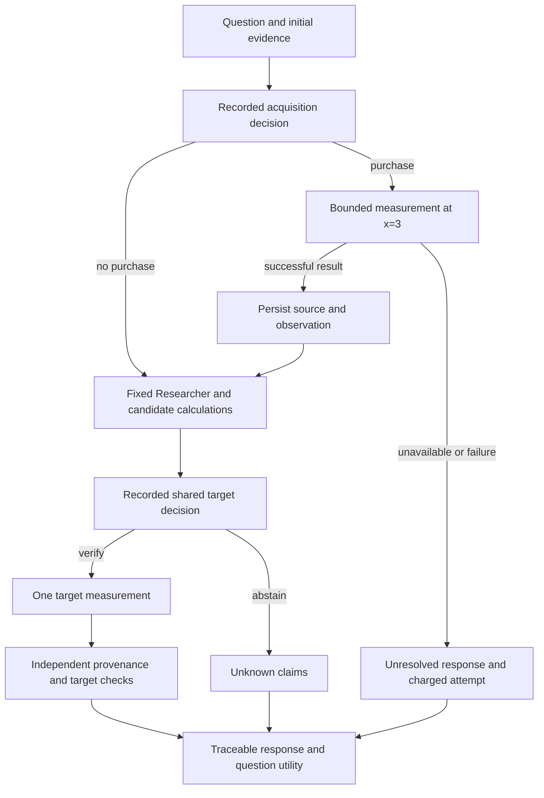

# Shared measurement and paid evidence

Phase 2B.1 is an opt-in extension of the existing deterministic Controller. It
implements the [registered protocol](experiments/phase-2b1-protocol.md) without
changing default behavior, canonical suites or the frozen Phase 2B Judges.

## Reproduction and dependencies

From `model-1/` in the recorded environment:

```sh
.venv/bin/python -m aim.paid_evidence_reproduce
```

Configuration: `configs/paid-evidence.json`. The driver loads the three frozen
rich/log/temperature checkpoints identified in the committed Phase 2B evidence
bundle. It requires the matching local checkpoint files and integrity sidecars;
these binaries are retained in `runs/` and are not published in Git. A fresh
clone therefore needs those exact artifacts restored. Re-training Phase 2B can
produce a separately identified reproduction, but must not silently replace
the preregistered parents or rewrite their recorded hashes.

The root run retains loading failures, full tests, a generated dataset pointer,
and final evaluation summary. The evaluation freezes config, parent identities,
fixture hash and policy list before executing episodes. Every episode has a
source archive, manifest, Memory ledger, state, final response and paid-policy
summary. Existing run directories are never overwritten.

## Controller integration

The default `Controller.prepare_evidence()` hook does nothing. The experimental
`PaidEvidenceController` overrides it, using the same fixed PolynomialResearcher,
ToolRunner, Memory and independent verifiers. It first records an acquisition
decision using only initial observations and candidate forecasts. If requested,
it dispatches a bounded MEASURE at x=3, creates an immutable observation source,
and adds its exact span to state before generating hypotheses again.

The same Researcher still interpolates the first two/three points. The fourth
point informs residual features and observation-fit policies; it does not
silently supply corrected candidate coefficients. The Controller alone passes
hidden measurement values to the worker. The Judge sees the strict observed-only
input contract from Phase 2B.

Acquisition UNKNOWN/ERROR/TIMEOUT stops the investigation unresolved. Missing
environment metadata or exhausted budget fails closed. Only actually dispatched
work is charged; unsuccessful dispatches still cost. The prototype has no
automatic retry or fallback measurement after failed acquisition. Conflicting
initial evidence prevents acquisition altogether.

After candidate calculation, `SharedJudge` records a question-level target
decision. All supported candidates either request verification together or
abstain together. The existing Controller dispatches one shared target
measurement and independently checks each requested claim. Individual calibrated
forecasts remain attached to their own events; the shared action heuristic is
recorded separately and cannot certify a claim.



## Utility and forecasts

Question reward is capped at one: R=1 iff any claim was actually VERIFIED.
U=R−cM*M−cA*A, with registered cM=.5 and cA=.1. Duplicate claims/predictions do
not multiply success credit, and target measurement is charged once. Retrieval
and calculation have no utility cost in this experiment, but action counts and
tool elapsed times remain recorded. Costs are illustrative units.

For learned policies, exactly equal predicted target values form one group;
take the maximum individual forecast within a group and cap the sum of group
forecasts at one. Verify iff that heuristic is >=.5. It is not a calibrated joint
probability or an independence model. Candidate inconsistencies and overlapping
numeric tolerance intervals remain limitations. The fixed reference candidate
budget prevents adding unlimited candidates for free success opportunities.

Always-acquire policies purchase before deciding. Selective acquisition uses the
strict band .2<initial aggregate<.8. This band is a registered heuristic, not an
estimate of expected information value. No new decision model or joint RL reward
is trained. Subsequent cost sensitivity re-scores the same observed actions; it
does not pretend the policy was re-optimized at each price.

## Evidence limits and factorial interpretation

All worlds start with three points. The known cubic perturbation is visible at
x=3. The new quintic perturbation vanishes at x=0,1,2,3 and differs at the target.
It is deliberately impossible to distinguish these particular base/quintic
worlds from the purchased observations alone. More confidence cannot restore
that missing information.

For the balanced base/quintic mixture, a frozen policy sees identical inputs in
each pair. With the registered candidate family, the base candidate can succeed
on the base world but neither candidate succeeds on its quintic counterpart.
At target cost .5, expected target-measurement utility in such a pair is zero.
An unconditional acquisition then subtracts .1. Thus the nonnegative-utility
gate is deliberately stringent on always-acquire policies in this stress
fixture. A failure there validates the information/accounting limit; it is not
an unexpected discovery about general Judge intelligence.

Two family choices and two mixture priors are evaluated by reweighting shared
episodes. Base-group bootstrap keeps all dependent variants together. There are
32 groups, 96 worlds and 13 policy variants, yielding 1,248 actual Controller
episodes. The four scenario views are not independent datasets. Source time,
network failure or real scientific laboratory costs are not represented.

## Programmatic use

```python
from pathlib import Path
from aim.paid_evidence import SharedPolicy, PaidEvidenceController
from aim.tracking import Run

policy = SharedPolicy("acquire_fit", config)
with Run(Path("runs"), "paid-investigation", config) as run:
    state, accounting = PaidEvidenceController(policy).run(case, run)
```

Use a valid existing case plus an acquisition environment with keys `x` (=3),
`available`, and `observations`. Hidden environment values belong only to the
trusted Controller. For learned variants supply a `ShiftJudge` loaded from the
frozen manifest. Use a fresh paid Controller per investigation. Inspect
`policy-summary.json` alongside `response.md`; the normal response preserves
claim/source scope while the separate summary records decisions, dispatches,
costs, capped success and state hash.

## Implementation map

| File | Responsibility |
|---|---|
| `controller.py` | Default no-op evidence hook; original verification loop |
| `paid_evidence.py` | Shared policies, experimental Judge adapter, acquisition and accounting |
| `paid_evidence_data.py` | Fresh grouped worlds and private measurement environments |
| `paid_evidence_eval.py` | Factorial weights, paired group intervals and fixed-action sensitivity |
| `paid_evidence_reproduce.py` | Parent resolution, preflight, frozen run and all episodes |
| `tests/test_paid_evidence.py` | Dispatch/failure budgets, provenance, temporal inputs and end-to-end cases |

General evidence-acquisition planning, learned Researcher transfer, joint event
calibration, retry/recovery policies and actual scientific tool pricing remain
separate decisions. Keep unsuccessful runs and test failures with their evidence.
